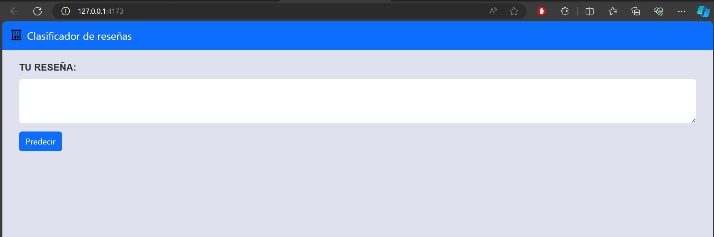
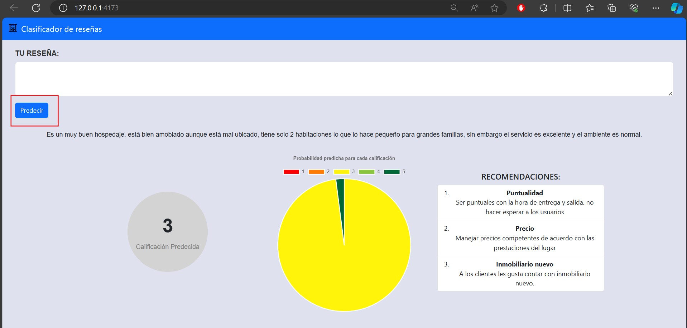

# Proyecto 1 - Etapa 2
## _Grupo 16_

- Samuel Alejandro Jiménez Ramírez - 202116652

- Eduardo José Herrera Alba – 201912865 

- David Cuevas Alba - 202122284

## Instalación

La aplicación está desarrollada en dos partes, front y back, se necesita  [Node.js](https://nodejs.org/) v16+ junto con el npm y [python](https://www.python.org/) v3.7+ para ejecutar el programa.

### Backend

Dentro de la carpeta raíz de la aplicación se debe correr el siguiente comando:
```
pip install -r requirements.txt
uvicorn main:app --reload
```

Tenemos que verificar que la aplicación esté corriendo en la ruta `http://127.0.0.1:8000/docs` para esto entramos a [esta ruta](http://127.0.0.1:8000/docs) y verificar que todo esté funcionando correctamente.

### Frontend

Para correr el front dentro de la carpeta raíz de la aplicación se deven correr los siguientes comandos:

```
cd front-reviews-app
npm install
npm run build
npm run preview
```

Una vez realizado este proceso verificamos que el front de la aplicación esté corriendo en [esta ruta](localhost:4173/) (http://localhost:4173/).

Cuando hayamos ejecutado todos los pasos anteriores estarémos listos para usar la aplicación.

## Uso

Para usar la aplicación nos ubicaremos en la dirección que obtuvimos en el último paso:



Para usar la aplicación pondremos la reseña en la caja de texto, luego le darémos al botón de predecir y nos encontraremos con un panorama como este: 



En la parte izquierda inferior encontraremos la calificación con mayor probabilidad que ha arrojado la aplicación. A continuación verémos un gráfico de torta interactivo en el que podemos ver cómo se distribuyó esta probabilidad (al pasar por encima de cada sector verémos la probabilidad correspondiente), finalmente en el lado inferior derecho encontrarémos recomendaciones específicas para esta calificación.

**Muchas gracias**
